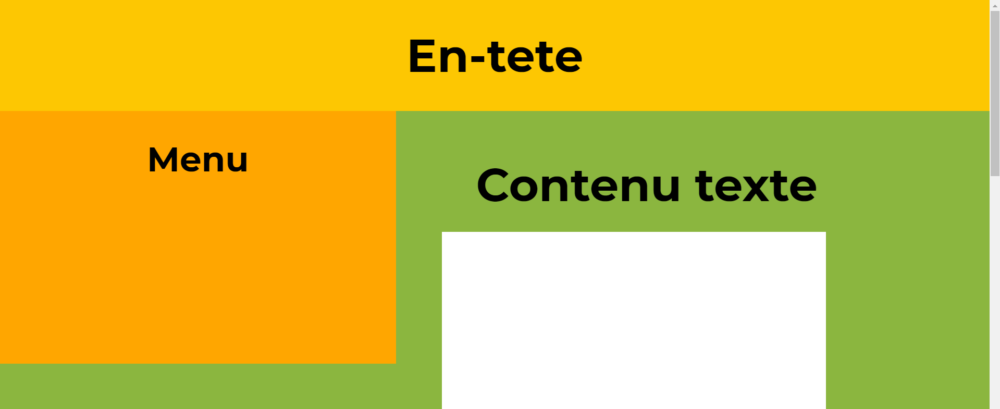

# Exercice de Responsive Design 🚀

Ce projet est un exercice de responsive design utilisant des media queries pour adapter le style de la page en fonction de la taille de l'écran.

## Structure du Projet

Le projet contient un fichier HTML avec des styles CSS intégrés. Les styles sont définis pour trois tailles d'écran différentes :

- **Petits écrans** (max-width: 767px)
- **Écrans moyens** (min-width: 768px et max-width: 959px)
- **Grands écrans** (min-width: 960px)

## Fichiers

- `index.html` : Contient la structure HTML de la page.
- `style.css` : Contient les styles CSS pour les différentes tailles d'écran.

## Comment Utiliser

1. Clonez le dépôt.
2. Ouvrez le fichier `index.html` dans votre navigateur.
3. Redimensionnez la fenêtre de votre navigateur pour voir les changements de style en fonction de la taille de l'écran.

## Auteur

Ce projet a été réalisé par Cherif Diouf.

## Licence

Ce projet est sous licence [MIT](LICENCE).